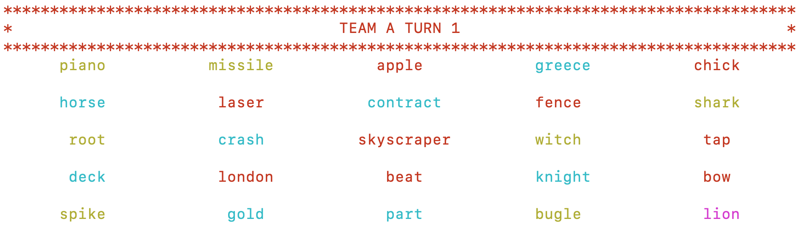
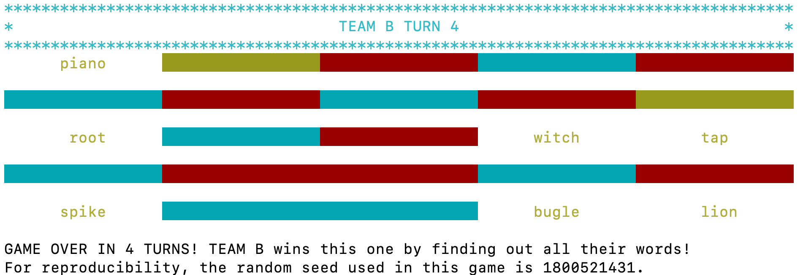
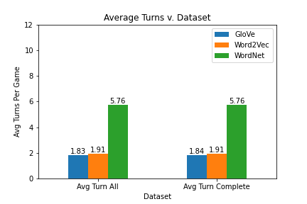
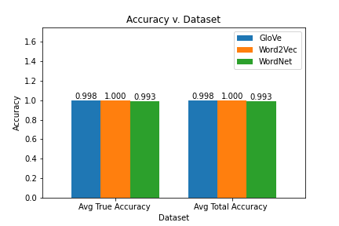
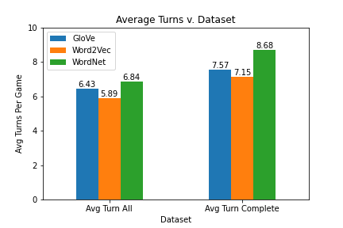
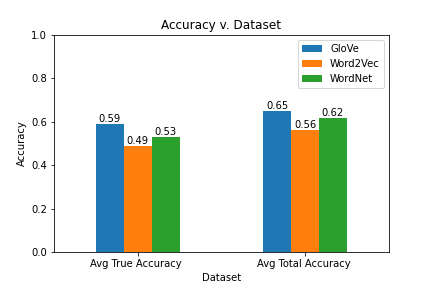
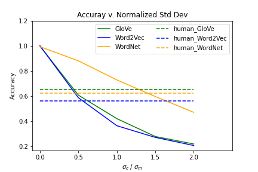

# Codenames AI
#### by Yongqing Li, Xuewei Yan, and Cameron Shaw

## What is Codenames?

Codenames is a board game with a fairly simple premise, guessing words. There are two teams and one board. On the board, there is a 5 by 5 grid of words chosen from a predetermined pool. Each word is designated either an agent word, neutral word, or assassin word. The objective for both teams is to guess their respective set of agent words.

Each team has a set of agent words that they have to guess on the board. In order to help the teams guess the correct word, each team has one designated Spymaster, who can see the words their team must guess to win as well as the identity of all other words on the board.

(Red = Team A, Blue = Team B, Yellow = Neutral cards, Pink = Assassin card)

The rest of the team, the Field Agents, or Guessers, don't know which words on the board are theirs. Thus, since the Spymaster can't tell the Field Agents exactly what words they must guess, the Spymaster has to provide their team with a single word hint. Using the Spymaster's hint, the Field Agents then have to guess which words on the board are theirs. Once a word has been revealed, that word is removed from the field. Both teams repeat this process until one team has guessed their words or a team guesses the assassin word. If a team guesses the assassin word, they immediately lose the game.

## Our AI

Our AI is written to simulate both the Guesser and Spymaster role. The AI was designed and tested with both AI only teams and AI/Human teams in mind. Our AI vocabulary bases are composed of the 30 thousand most common words found in Wikipedia articles. We created vector embeddings from 3 types of word relationship measurements, Word2Vec, GloVe and WordNet, for the AI to understand the relationships between words. Each of these is a separate way to view similarities between words, and in our testing we found that each of these similarities provides a different gameplay experience for Human/AI teams. We allow players to choose between the three vocabulary bases at the beginning of the game.

Given its knowledge base, the AI Spymaster then compares one of its teams' words to its knowledge base, and then gives the hint it believes best fits the words it intends for the Agents to guess. 

For an only AI team, this process is incredibly efficient. Since both the Agents and Spymaster have exactly the same knowledge base, the AI team can guess words nearly perfectly every time. We see on average that only 2 turns are needed for the game to finish, and perfect accuracy in identifying the intended words.

Where there is less certainty in performance is when the AI is forced to deal with a human teammate. Due to the difference in knowledge and thought process between the bot and  human, we had to design the bot to change strategies with a human teammate. An AI Spymaster has to give hints that are more obviously related to the words on the board, and an AI Agent has to be more accurate and conservative with its guesses. Thus, the weights of each word must be different for an AI Spymaster to generate the best hint for its human teammates. This is needed to compensate for the difference in thought process and fine tuning the various hyper-parameters required for understandable AI/Human interaction took the longest out of this entire project.

## Parameters

After creating the framework for the relatively simple game rules, the framework for the AI's processes was swiftly created. We tested these early versions of the AI using a few algorithms trained on several datasets. A few algorithms had to be scrapped when other strategies turned out to outperform them entirely, and we eventually settled on using the most common words in the Wikipedia dataset. The size of the dataset for the AI's knowledge base and most efficient algorithm was decided by testing it on a large number of AI vs AI games, and measuring how swiftly the bots finished games for each combination of setups. Testing resulted in our final 30 thousand word dataset being chosen, since it was the most efficient for the least amount of storage space, and our final algorithm was chosen after it outperformed all of the other contenders. Since the three similarity calculations were so close, we decided to allow the player to decide between them, and decide which best suited their thought process.

## Performances

Performance of teams with an AI Spymaster and human Guessers are tested in order to understand the effectiveness in their communication. Compared to an all AI team, the AI/Human team took more turns to finish the game and its accuracy in uncovering the team words has dropped. This result is expected as there exists a gap between the AI and human knowledge base.

We were also curious on the amount of distraction needed for an AI guesser to behave like a human. Thus we introduced a confusion matrix in the algorithm to add noise for the AI guesser. We sampled the matrix from a Gaussian distribution with mean 0 and standard deviation σ. Because each dataset utilized different measurements, we rescaled each σ for all three datasets accordingly.  We observed a σc/σm value of 0.5 for GloVe and Word2Vec and 1.5 for WordNet to produce a similar performance to humans in terms of accuracy.   

## What We Learned

Our main takeaway for this project has been twofold. The first is that creating a AI teammate for a game about word relationships is very much possible. The performance of our bot is very good for the relatively simple rules of this game, and given time, could be expanded into a more complex implementation of Codenames. Secondly, the creation of an AI for an examination of relationships between words using vector embeddings and similarities may not be the most efficient way to achieve this result. While our AI does achieve good scores for Human/AI interaction, it is not as accurate as a full Human team, nor is it as efficient as a full AI team. With the difficulties we had in adjusting the hyperparameters for this strategy to allow for functional Human/AI interaction, we believe using other strategies to achieve the same result would be more effective at simulating the thought process of a human mind when it comes to Codenames.

## Relevant Links
If you'd like to play the game, visit this *[Github repository](https://github.com/XueweiYan/codenames-game-ai)*.

If you'd like to see run the analysis and testing for this project, visit this *[Github repository](https://github.com/YongqingLi14/codenames-ai-analysis)*.

If you'd like more details on this project, visit this *[Page](https://github.com/YongqingLi14/artifact-directory-template/blob/main/report.pdf)*.
