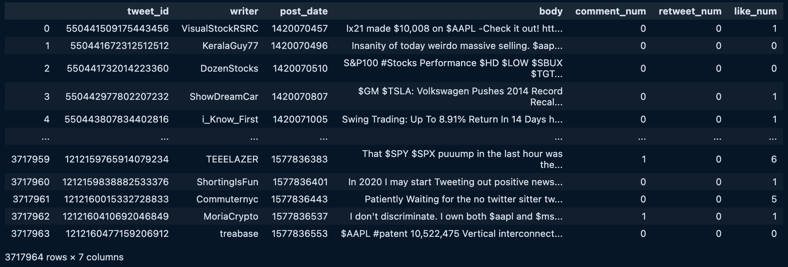
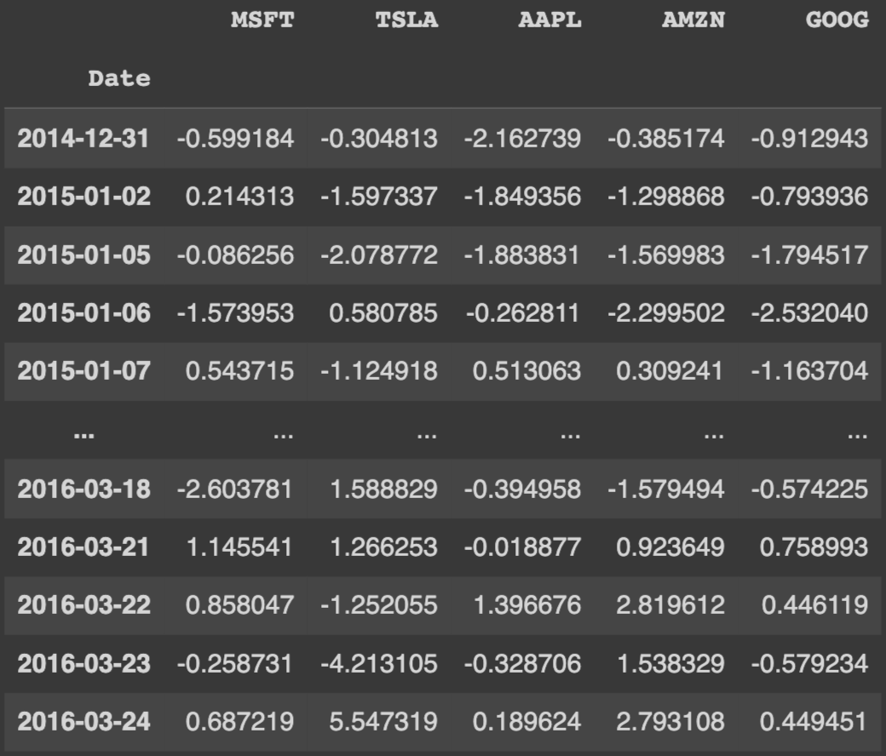
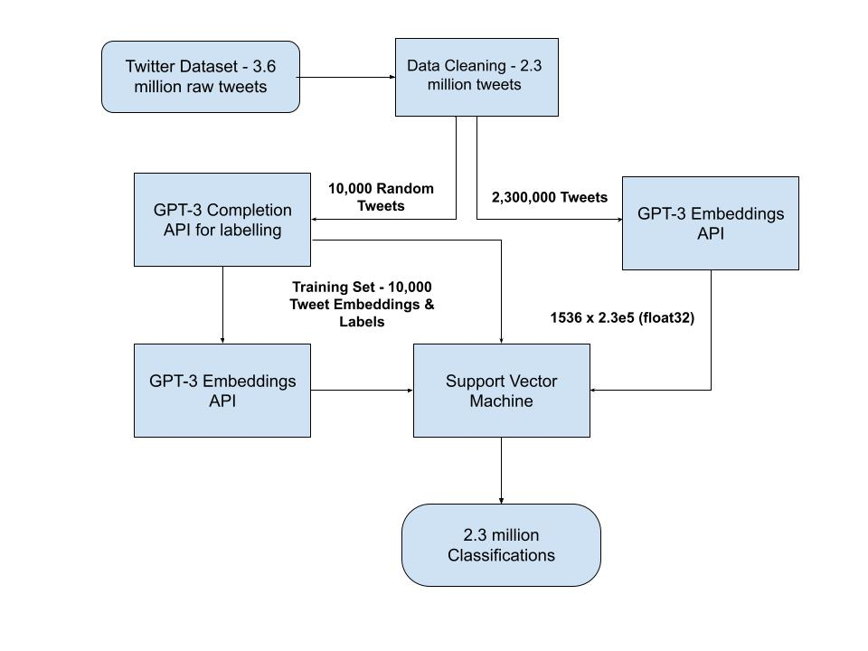
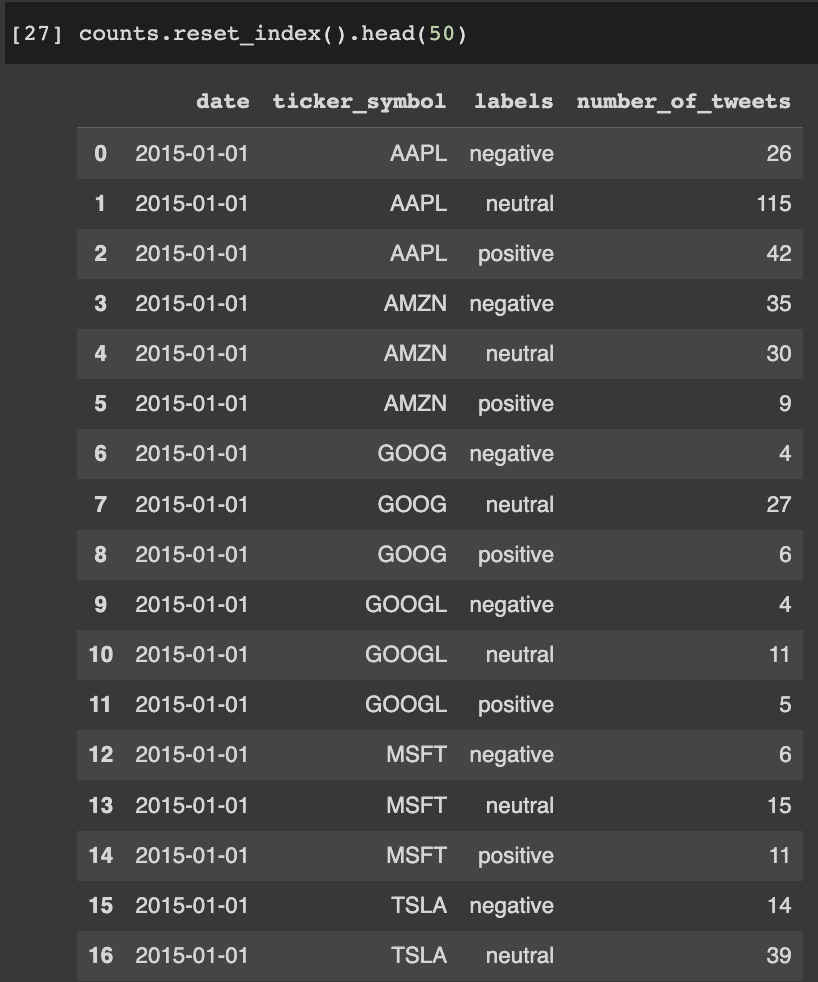

# Predicting Financial Markets with Wisdom of the Crowd

#### by Justin Cun & Dakshh Saraf

View our full report published using *[Google Docs](https://docs.google.com/document/u/1/d/e/2PACX-1vRPYXEIF40u9JPjKuAMk8yD-Lg7oJndQEGjk-kuN-4e8nr_jCpkNrD2Wu5Fev7K5JCJnlt0lFg_yPBT/pub)*. 

## What is wisdom of the crowd?

The concept of the wisdom of the crowd pertains to the collective opinion of a diverse and independent group of individuals, as opposed to relying solely on the expertise of a single individual. Popular social information websites such as Reddit, Quora, Twitter, and Stack Exchange draw upon this collective knowledge of the crowd. An explanation for this phenomenon is that each person's judgment has some unique bias or noise, but by averaging the responses of a large number of people, we can cancel out this noise and arrive at a more reliable conclusion. 

## Introduction

Moreover, using the wisdom of the crowd metholodogy in the context of financial markets, we can attempt to prove whether or not it can be a practical approach for market predictions. This is essentialy the inspiration for our research question - "Is wisdom of the crowd a viable methodology to predict financial markets?" Using a medium such as Twitter, we're able to delve deeper into this question by analyzing batches of tweets from popular stock tickers and build predictive models.

## Datasets & Data Cleaning

To collect data for our analysis, we used a Kaggle dataset of 3.6 million financial tweets collected between 2015 and 2020 for the top 5 tickers in S&P 500. We conducted thorough data cleaning to filter out irrelevant tweets and ensure that only relevant tweets about stocks were analyzed. We also used the Yahoo Financial historical API to obtain historical prices for the respective stock tickers.

 

*Kaggle dataset of 3.6 million unique tweets from the top companies from 2015 to 2020, including Tesla, Google, Apple, Microsoft, and Amazon.*

 

 
<em>Yahoo finance dataset which includes percent change in stock price everyday for relevant tickers</em>

## Classification and Model Selection

To start our classification, we utilized the GPT-3 field embeddings API to capture the context and meaning of the words in the domain of social media. Next, we asked GPT-3 to label a random subset of 10,000 tweets as Positive, Negative, or Neutral, providing us with a set of labeled data for training our model.

Using these GPT-3 embeddings as our input value and GPT-3 labels as output labels, we trained a Support Vector Machine (SVM) to classify the remaining tweets. *We chose to train our own classifier instead of having GPT-3 label every single tweet of the >2 million tweets because it would cost us over $1000*. We ultimately passed all the 2 million embedding vectors into the classifier, and were able to label every tweet into “bullish”, “bearish” or “neutral”.

 

<em>Diagram of final model architecture</em>

 

 
<em>Dataset of number of positive, negative, and neutral tweets for each day from 2015-2019</em>

## Our Results

In our initial findings, we found that the Neutral tweets overpowered our results. Of the initial 10,000 tweets classified using GPT-3, 70% were labeled as neutral which had a significant impact on our results. This bias likely persisted when we trained our SVM classifier on the remaining 2 million tweets. As a result, many of our predictions were also neutral.

To address this issue, we decided to remove neutral tweets from our analysis, which resulted in a marked improvement in our results. The confusion matrix for $TSLA showed that our model accurately predicted 75% of the labels when labeling "Positive" or "Negative". Although removing neutral labels resulted in significantly fewer data points, our overall results were much more accurate.

## Future Improvements

In future iterations, real-time streaming clients like Astra DB and Twitter API could be used to provide more relevant and useful predictions. However, as of February 9th, 2023, Twitter no longer offers free access to its API, making projects that involve collecting data from Twitter impossible at the moment. Despite this limitation, with streaming clients, we could filter specific tickers such as $TSLA and classify hundreds of relevant tweets every second, providing users with up-to-date and actionable information that could inform trading strategies like day or swing trading. 

## Conclusion

Using GPT-3 field embeddings and SVMs, our research classified tweets into Bullish, Bearish, and Neutral sentiments and demonstrated the potential of the wisdom of the crowd. While further research is needed to improve accuracy and usability, our study showcases the potential of natural language processing techniques and sentiment analysis in fields like economics and financial markets.

## Relevant Links
If you'd like view the repo, visit this *[Github repository](https://github.com/dsaraf-hub/DSC180A-Capstone_Quarter_2)*. 
